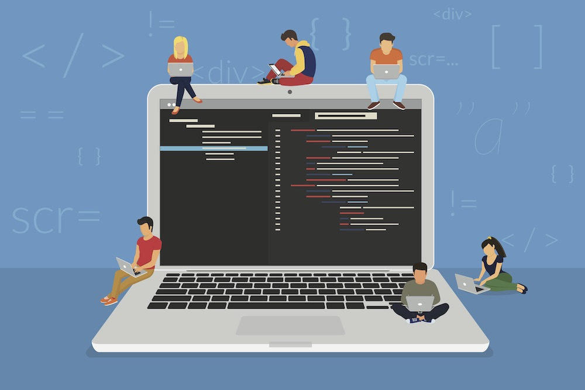

### Building Rome

To be perfectly honest, I had no idea what software engineering entailed. In my mind I hand-waved it and watered it down by categorizing it as just "creating software and apps" and never gave it another thought. I didn't think deeper than surface level about what that meant. Now, as I further my career journey in pursuing a Bachelor's in Computer Science and explore the possibilities of this field through internship experience and classes, my perception of Software Engineering has widely expanded the world I was viewing. 

More than just "creating apps," Software Engineers deal with designing, development, testing and maintaining software applications with engineer concepts and programming language. It's fun and interactive, and wholely allows for creativity in design while incorportating crtical thinking in execution: How are we going to evaluate and test our program? How are we going to optimize this software, make it more functional? 

In the big picture and scope behind just "creating apps" there are also concepts of Open Source Software Development, Configuration Management, Functional Programming, Development Environments, Coding Standards (Which I briefly discussed the importance of in a previous post), User Interface Frameworks, Agile Project Management, and Design Patterns... etc and many others. While previously I had considered going down a more security focused route of Computer Science, I find software development much more enjoyable. 

### Rome was not built in a Day

Although it would take longer, I'm sure there are some people who would consider it easier to just work on a project by yourself. You don't have to go through the trouble of communicating with others and arguing about being on the same page, and waiting on people to do their part so you can do yours...etc, and I'm sure at one point in our lives, we've all had an experience with bad team members that just made us *hate* group work. But working in a team is kind of unavoidable as a software engineer. 

In concluding this class, I, and a team of four other students, created a software application to match students to local companies called Job Match'UH (more information can be found under my Portfolio Project's tab). It was an extensive project that exercised many of the concepts of software engineering, but most importantly could not be completed without exercising concepts of Agile Project Management. I've worked on many group projects before in many different classes, but in working on this final project, this class made me redefine what it really means to work with others in a software engineering setting (that I will most definitely use to apply in other settings as well). Agile Project Management is a complex, contextual way of managing a project. Specifically, I used a style called Issue Driven Project Management. 

It's a newer project management philosophy that is characterized by features such as

1. Time-Box: Updates and guaranteed releases on a deadline.
2. Business Value: Delivery of business value that is creating a system that is useful.
3. Adaptive Planning: It's continuous, in-depth planning for near term, and course planning for far term.
4. Emergent Feature Discovery: Detail features at the point of implementation, allows us to prevent a whole redesign of a plan during development
5. Continuous Testing: develop tests in parallel

These concepts that we implement using Agile Project Management allows proficiency in working in a group setting and organization. It limits failure with principles that set you and your project group up for success. Going back to some of the reasons one might hate group work, Agile Project Management eliminates waiting for someone to complete a task because you and your team have defined a set of tasks to work on in the near future and you know what to work on next after completing a task, you don't have to be blocked by another person to do it. Issue Driven Project Management is a style that capitalizes on this and is defined by features that organize and divide issues.

Outside of software engineering, this is a great foundation for groups to build from that allows one to thouroughly communicate with your teammates and eliminate confusion. Everyone would be on the same page and the state of project is always communicated, and overall allows for complete transparency without having to prompt for awkward communication from others. It truly forces efficiency when everyone is cooperative in using this style. 

### Brick by Brick

On the surface level though, and from a creative design aspect, User Interface Frameworks is another large aspect of Software Engineering I want to discuss. It's basically an archetectural aid that helps front-end web creation. Essentially, it's a template that helps developers create beautifully formatted and designed apps. I think this was the aspect of Software Engineering that I had the most fun with. It allowed me to exercise my creative side. So why use UI Frameworks and why is it important? Well UI Frameworks is essentially a common template that's used by a lot of other developers. It efficiently saves time from all of the hard coding in creating a software, and the effort of starting from scratch. "WORK SMART NOT HARD," Efficiency is BIG in the computer world, while it is surely very impressive to say you can design something entirely from scratch, it's not practical to recreate this on a huge production scale. Using UI Frameworks saves manpower, time consumption, and in a company setting, saves money. It also just helps to eliminate error since this is already a verified template used by many other software developers. 

This ties into the concept of Open Source Software, which basically is a model and process that allows for code to be publicly accessible. In this world of technology, one creation can serve as a jumping pad for other's to launch off of. It allows for team work and collaboration and the exponential growth of technology. In the same way the science world demands the publication of research so other researchers can replicate experiments, it furthers along discovery and allows our society to find new ways to solve a problem in our community and industries and emphasizing concepts of continuous improvement and efficiency.  
