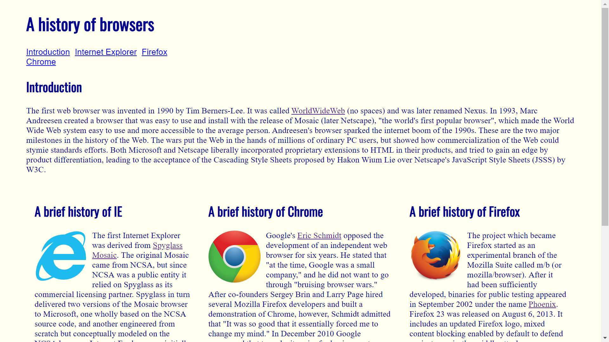
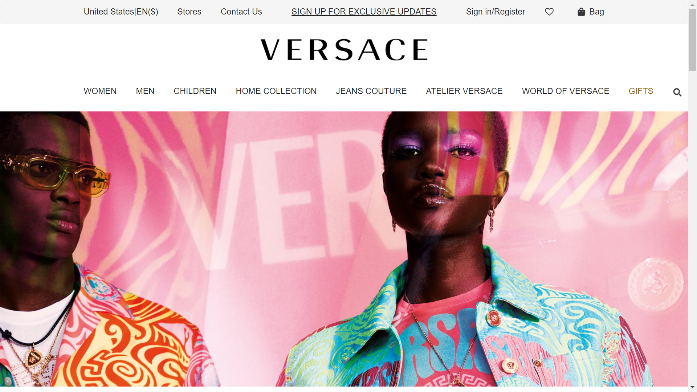
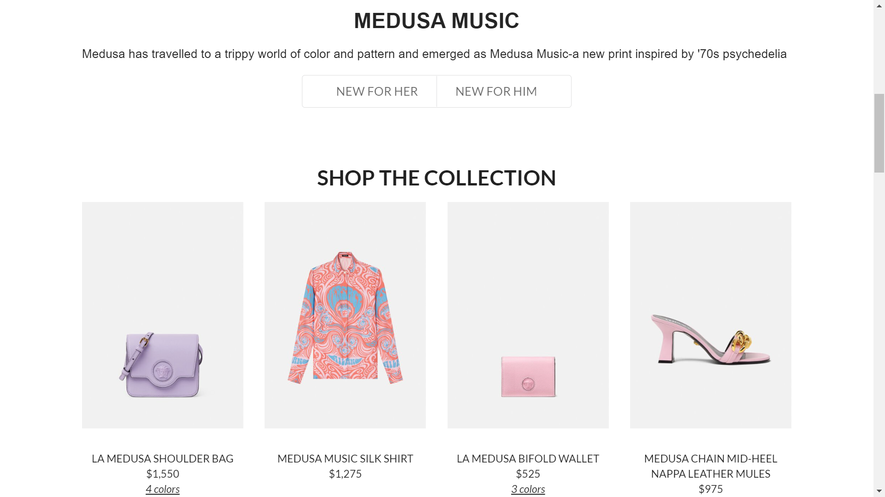

### What is your passion in life?

Before we transitioned our online class to in-person, our professor used to give us surveys to fill out at the beginning of our class for attendance. I remember one of the survey's asking a fairly simple question: "What is your passion?"

Although simple, it's probably a question that you wouldn't often think about unprompted. At least, I didn't. Now, these attendance survey's we took were typically short, so everyone else had answered it fairly quick, but I on the other hand, remember sitting there in slight panic, staring at my computer screen, a little stumped, and with the sudden realization that...maybe...I didn't actually know how to answer that question. To be honest, I think I internalized that question a little too seriously that day. If my life was a movie and I had to capture this revelation in a cartoon, you'd see it in loud exclamations, framed in bright glowing lights. My eyes would be wide and there'd be a distant gong sound in the background. It just kind of made me realize how I was just floating in life, and I started to wonder when exactly I began to feel that way. "Why was I here again? What is my purpose?" 

I thought about "the before." I was really lost thinking about my future, and, if you've followed long enough to read through all my posts on my page, you'd know that Computer Science wasn't actually my first choice. It took me a while before I reached where I am now. So, it was such a relief to me when I had finally decided on Computer Science. It was like the gears aligned and everything clicked in place, I took that feeling and I ran with it. The world was bright and glittery, and I ran as unabashedly as a little kid would: with no fear of scrapes or tumbling down (kind of terrifying). Then, as I sat there, forced to rethink my purpose and my passions, I asked myself, "Do I still align with these thoughts? Am I just sticking with this because I feel pressure to see this through? Is this still something I genuinely want to do?" If I really thought about it, the first thought that actually came to mind was "Art." But not in bright exclamations. The thought came soft, as a whisper, weak and easily dismissable. Kind of like the distant memories of your first love, shoved messily away into the back corners of your mind.

  

    
  

  

    
  

  

### The American Dream

Growing up, I've actually always liked all things related to art. Anything that allowed me to express myself creatively, I took in large strides, whether that was painting, sketching, crafting, writing...etc. I went overboard with presentations and projects, I was always greedy for those little pockets of opportunities where I could transform a space with my own branding. Being the oldest child of first generation immigrants, I didn't have to endure the struggles that my parents had to. They were always gone from home because they worked hard to provide for me and my younger brothers, which in turn created pressure; I had to be the role model, I had to grow up fast. I craved an outlet to express myself. My parents are also older and a bit more on the traditional side, which often times made me feel distant from them, so art was one of the few things that allowed me to feel connected to my dad because he used to do a lot of oil paintings and wood carving scultures. On the other hand, there was also a lot of pressure for me to "succeed." My parents spent all this effort to move to America in pursuit of the American dream with the hopes that I would have more opportunities in my future than they did. My chinese name, 采(cǎi) 蓉(róng) (which I've just learned recently), means to pick from a variety of options. My parent's dream is reflected in my name. Both a beautiful sentiment and a weightful burden.

### Duty > Passion

In the end I ended up discarding art. I remember in middle school when I confided in my parents about the uncertainty of my future, they reassured me, saying they would support me in whatever I wanted to do in life. But when I met them again with this same topic to get their opinion about me pursuing art, they told me that art wasn't worth pursuing and I wouldn't make any money. I was confused and disappointed by their contradiction. By freshmen year, I discarded art all together. I traded art electives for STEM electives, I chose activities that would look good in a resume, and by sophmore year of high school, I was dually enrolled at a community college. By graduation, I wracked up 21 college credits and steped up on that stage as class valedictorian. I don't say this to boast my accomplishments, but merely to point out how this lead to my burn out. I was tunneled in on a very rigid and boxed idea of success. 

### Not so Black and White!

I can't quite recall what I typed out that day for my response, maybe I did write art, but I do remember feeling compelled to answer in what I *thought* my professor would have wanted to hear: that my passion was something computer-related. Because, otherwise, why would I be here, sitting in on a software engineering class as a computer science major, to soon pursue a computer-related field in the future? It's not to say I ended up begrudingly choosing Computer Science as a second choice though, I do thoroughly enjoy coding and the sense of accomplishment that comes to problem solving a code. Its rewarding and challenging to me in a different way than art, but I guess I never really thought about how I could incorporate my passions together. Art and creativity can parallel technology as well. Thinking about it now, it isn't as rigid as left or right, art or science. Art and creativity can bleed into anywhere. I don't have to completely abandon it. 

### Semantic UI!

That's why moving into Semantic UI (User Interface) for my software engineering class is so exciting for me. Semantic UI is a developmental framework that helps create layouts using HTML. 

In the example picture above, I have a website created using *just* HTML. Not terrible, it's actually kind of cute. It's got three nice even columns and small pictures of the browser logos to brighten up the page, the background has a nice cute little ivory tone. 

But I think the real star is the next few pictures below. For this class I did a recreation of the Versace website using Semantic UI. I like the clean, sleek, minimalist layouts seen in a lot of marketing for high-end brands. When you look at these pictures, in comparison to the one above, already, it's bright, it's colorful, it's eye-catching...like, 'wave your money in the air because I want to hire you as my web-designer "eye-grabbing"'...well...maybe, I still have a long way to go and more techniques to learn. But if you saw these two in a portfolio for candidates applying at your company, surely you can tell that the second set is more favorable.  

  
  

### Familiarizing Yourself

If we coded in just raw HTML and CSS, imagine how deliberate and long it would take to format everything! Just thinking about the effort it would take to build a top bar menu from scratch is painstaking. UI frameworks can be complicated to learn at first, but if you've read my post about on formatting (particularly with ESLint), [Familiarity in Formatting](https://larissa-tsai.github.io/essays/familiarity-in-formatting.html), stepping out of our comfort zones is how we learn and grow. UI frameworks helps to condense that effort into premade recipes. You want to format your page a certain way? Semantic UI helps provides formatted styles for you with example code and from a variety of options. 

I used to have one mentor that would repeat this to me often, "Work SMARTER! not HARDER!" The fact that he said this often made me realize just how stubborn and hard-headed I was. I was too fixated on one way and always took the long route. Working with him honestly made me learn flexibility. Just because I learned something a certain way, does not mean that I cannot be open to other methods that could optimize the process. How can I use this new tool to make my coding easier and better? More functional? There's always the slow start when we learn something, it can seem too hard when you're not used to it, maybe it even seems like a hassle. Though there's a payoff in investing into technology and software, and that payoff is functionality. Anything you try for the first time is not guaranteed to be easy. It's like riding a bicycle, maybe the first few crashes and burns at the start of the learning experience might deter you, but after you master it, biking certainly makes getting to places a lot quicker than walking.

To relate it more closely with something we've worked on recently, it's honestly like working with the Underscore library for Javascript. A bit foreign, kind of confusing when you don't know what does what, but as you practice and familiarize yourself with the functions, you get quicker at recognizing what you need to utilize and where to implement it to get the job done. Coding in raw HTML made struggling through Semantic UI a breeze. And it gave me the creative freedom to design layouts and be inspired by other artists. 

Here's another saying to end it off, "You sow in tears before you reap in joy," meaning sometimes you just have to work through the struggle before you can relish the benefits. 

