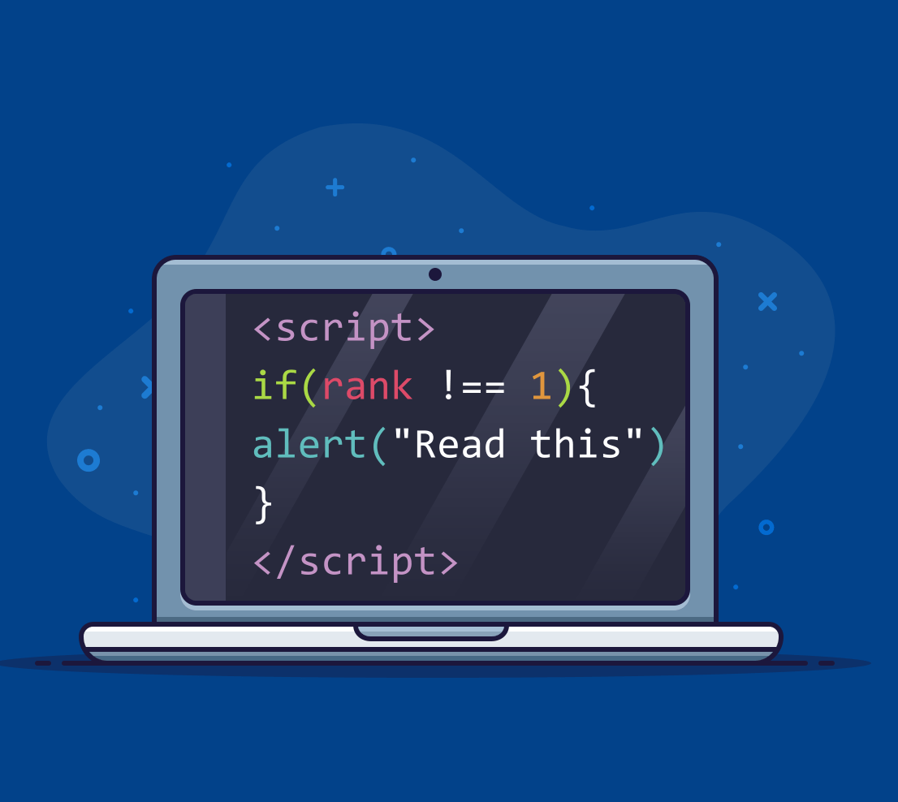

Computer Science wasn't my first choice. I graduated from my high school as my class's leading valedictorian and had gotten in to West Point, a distinguished military academy with a super selective acceptance rate...many could say that I was an accomplished individual, but really, I was just kind of ... lost. I didn't quite know what I wanted to do with my life. My main goal was pretty straightforward and that was to graduate high school and go to college. I never really had time to explore or really find out what my passion was, because I only ever took classes that would benefit my academic career. My parents never got that opportunity to go to college and get a higher education. By doing so, I was fulfilling their ideas of success and the "American Dream." While also growing up with the focus of school and assimilating to life in America, I felt like I lost touch with my culture, and without knowing what else I wanted to do in life, I just ended up majoring in Chinese. I figured I could do something related to foreign relations.

But then on the side, I ended up taking a simple and easy IT course in python. It was fun, and I found myself liking the class a lot more that I thought and enjoyed coding. I ended up switching majors in my second year and found myself pursuing a new passion in computer science. I am fairly new and lack experience, so when I switched majors and was suddenly taking classes on Java and C/C++, I found that learning new programming languages can be quite difficult! Python was so easy! However after finishing those classes and now learning Javascript in our modules on FreeCodeCamp, I found that it was surprisingly easy to pick up. The modules were interactive, and you could instantly apply what you've just learned after each course. I think in another perspective, perhaps it was easier to pick up because now I am a lot farther in my coding journey, albeit not at a mastery level, I am no longer struggling as much as when I first started! In comparison, I feel like Javascript is a lot more straightforward and beginner friendly. It's flexible and adaptable and condensed a lot of the commands we type, which fits well with software engineering in my opinion.

Something I look forward to is our "Workout of the Day" (WODs) where we utilize what we've learned in short coding exercises, that generally take at most 15 minutes to complete. The thing that first appealed to me about computer science was the sense of satisfaction coding gave me. It's like a puzzle, and it can be frustrating to solve if the answer doesn't seem straightforward, but it makes the satisfaction that much more lasting when you've struggled through to solve it. I typically like learning this way because rather than learning through a textbook or lecture, I can actively apply what I learn immediately and run through it multiple times as needed for my own personal practice!

