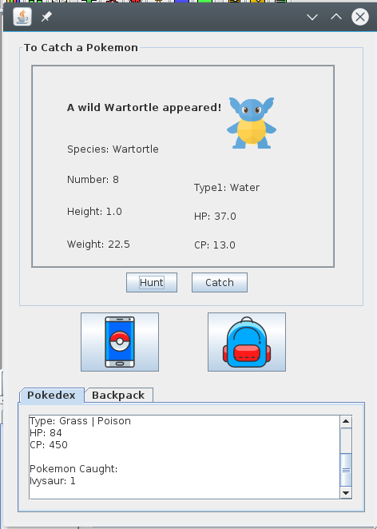

 

If you've never heard of Pokemon, quick rundown is that it's a popular franchise that has multiple sucessful season tv series, and a game with a large fanbase, both virtually and physically (i.e. cards).

The Pokedex program was a Graphical User Interface (GUI) Pokemon game that I helped create in a team project for ICS 211, Fall 2020. This project was a comprehensive learning checkpoint that utilized all the skills that we learned that semester with Java and applications. We were allowed to be creative and design the application as we wanted. It built upon previous programs we wrote throughout the semester with various Pokemon objects and class data structures.

Our Pokedex is implemented using [jGrasp](https://www.jgrasp.org/), a development environment in Java coding language that allowed us to create software visualizations. We also collaborated with teammates through gitHub so that we could both edit the code together but separately and learned to branch and push commits to update changes. We also did peer code review for feedback on how to improve our program. Some features in our program included a "Hunt" or "Catch" pokemon feature in the upper portion. We used learned data structures to store Pokemon, and wrote code that would display information about the Pokemon as you would find in a Pokedex in the lower portion of our GUI program.
