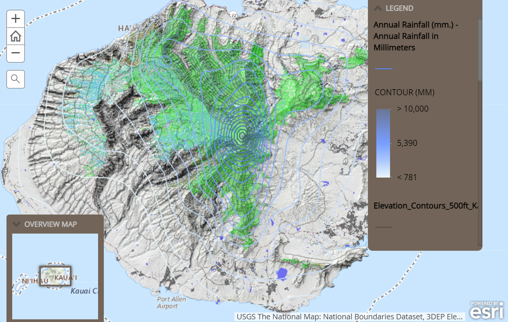

  
  

This final project involved story mapping a few endangered plant species on Kaua'i, we could not fully share the location of where they are located because of plant poachers, but we collected data and data mapped them on a geographic information systems so we could use that data for endangered plant conservation analysis. To still be able to provide information without revealing the specific locations, we generalized it by locating their location relative to our islands ahupua'a. Our main goal/purpose in this project was preservation. Growing up from Kaua'i and having the chance to travel else where, I've realized that it is such a privilege to have such a beautiful place to call home. 

While Hawaii is beautiful, it is also home to a lot of endemic plants that face the danger of extinction. With Hawaii's history of colonization, the plants native to the island also face danger of being pushed out of existence with invasive plants! A lot of our data and research was collected with the intent to spread awareness and provide analysis on what is affecting their population and how we could minimize the impact of decimation. 

To narrow down the scope of our project, we decided to focus on two main native and endangered plants: Hibiscus Clayii, and the Polyscias Racemosa. 

Our research relied on maps from Kaua'i's Critical Habitat and the Hawaii Statewide GIS map that would provide locational statistical data and data on elevation and rainfall. We also coordinated with a GIS project staff from our island's National Tropical Botanical Garden. 

You can learn more on the introductory story map me and my project partner created a few years back [Kauai Endangered Plants](https://kapaahigh.maps.arcgis.com/apps/MapJournal/index.html?appid=4f38c31923f94adebb515efb916e8461).
