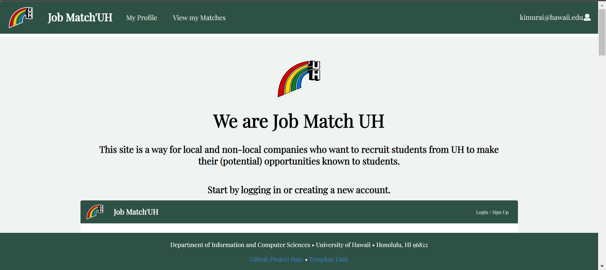
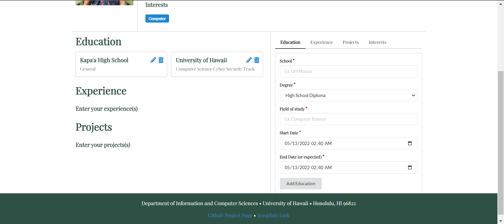
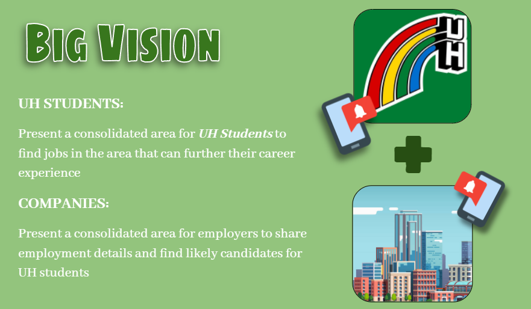
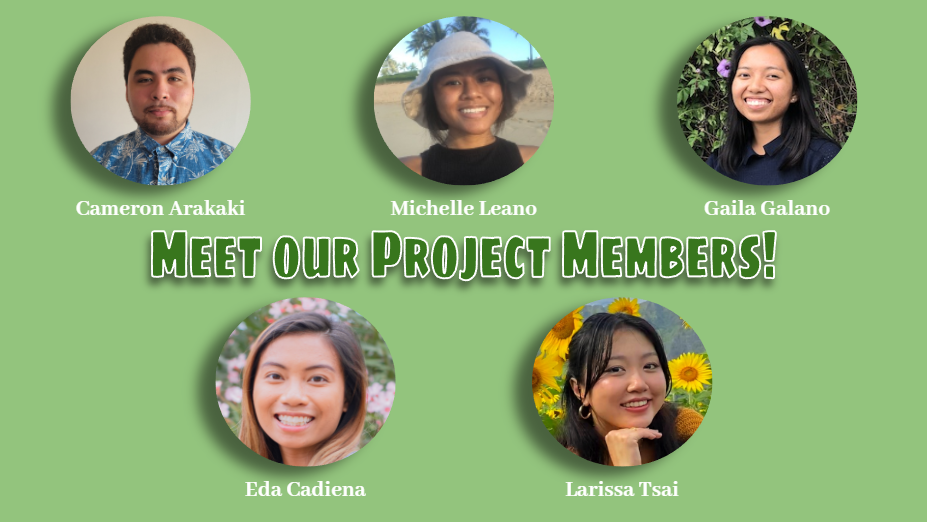

  
  

### Materialized from Star Dust

When we first started this project, I don't think we could have forseen the unexpected complexities behind turning an idea into reality. It was easy for us to say one thing about the application and envision the functionality at a surface level, *until* we had to put in work and think deeper about *how*. *"How can we make this project come to life?"* Initially, our prompt was to connect companies to UH students and connect UH students to companies within the community. We took that a step further to think how we wanted to implement this and more importantly, "How do we want to make this final project prompt unique to our team?" In our project planning, we thought, why not create an app that matches people? Like how a dating app matches two people but in a professional setting? Thus a LinkedIn-Tinder Love Child was born. In the weeks leading up to this grand birth, we had to figure out how to accomadate our idea. 

### Your Team is only as Strong as your Weakest Link

I definitely don't think I could have done it without my team members, [Eda Cadiena](https://ecadiena.github.io/), [Cameron Arakaki](https://carakaki808.github.io/), [Michelle Leano](https://michnotmeesh.github.io/), [Gaila Galano](https://gailag.github.io/), and our class Teaching Assistant (TA) Branden Ogata, who helped fill in the holes and gaps of my inexperience with knowledge and fresh eyes. In class we learned a lot about the design of a web app, how to create buttons and format a page with grids and columns, and creating a website is easy these days (outside of hard coding and backend development), you can create one through wix or google sites and they'll have all sorts of templates and formats, and all you have to do is write in them and fill it with pictures. 

Our deployed web application can be found here: [https://jobmatchuh.xyz/#/](https://jobmatchuh.xyz/#/).
More details behind the process of our project can be found in our project homepage here:[https://job-match-uh.github.io/](https://job-match-uh.github.io/).
And the source code can be found here: [https://github.com/Job-Match-UH/source](https://github.com/Job-Match-UH/source).
